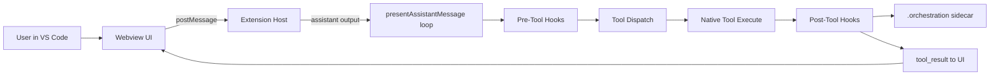
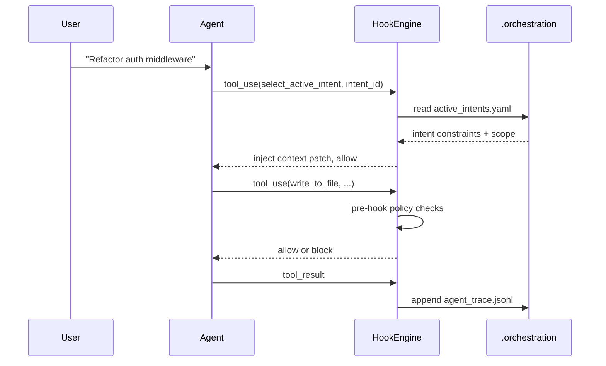

# Hook Diagrams And Schemas

## 1) Runtime Boundary Diagram



## 2) Two-Stage Handshake Sequence



## 3) Hook Engine Schema (Type-Level)

```ts
type HookDecision =
	| { allow: true; contextPatch?: Record<string, unknown> }
	| {
			allow: false
			code: "INTENT_REQUIRED" | "SCOPE_VIOLATION" | "DESTRUCTIVE_BLOCKED" | "HOOK_ERROR"
			reason: string
	  }
```

## 4) `active_intents.yaml` Schema (Minimal)

```yaml
active_intents:
    - id: "INT-001"
      name: "JWT Authentication Migration"
      status: "IN_PROGRESS"
      owned_scope:
          - "src/auth/**"
          - "src/middleware/jwt.ts"
      constraints:
          - "Must not use external auth providers"
      acceptance_criteria:
          - "Unit tests in tests/auth/ pass"
```

## 5) `agent_trace.jsonl` Record Schema (Minimal)

```json
{
	"id": "uuid-v4",
	"timestamp": "2026-02-18T12:00:00Z",
	"intent_id": "INT-001",
	"mutation_class": "AST_REFACTOR",
	"vcs": { "revision_id": "git_sha_hash" },
	"files": [
		{
			"relative_path": "src/auth/middleware.ts",
			"ranges": [
				{
					"start_line": 15,
					"end_line": 45,
					"content_hash": "sha256:..."
				}
			]
		}
	]
}
```
