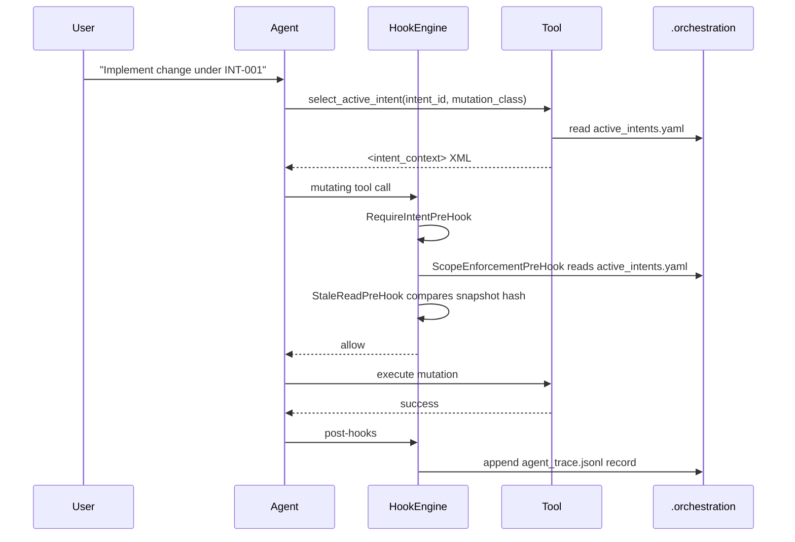
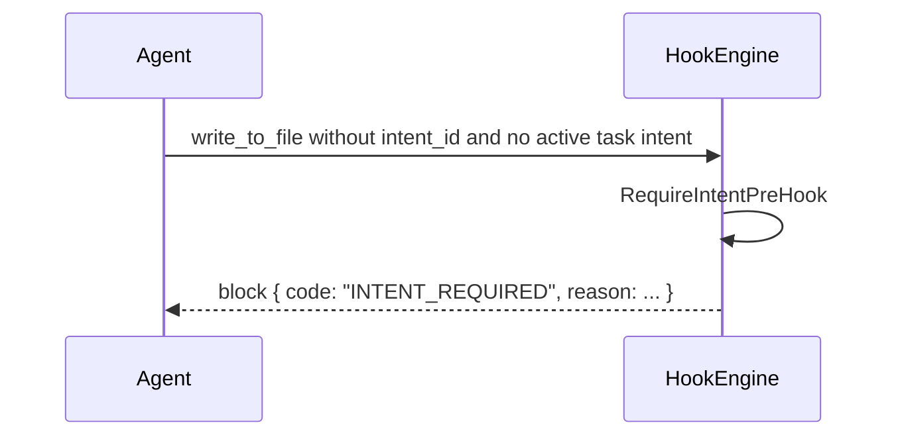
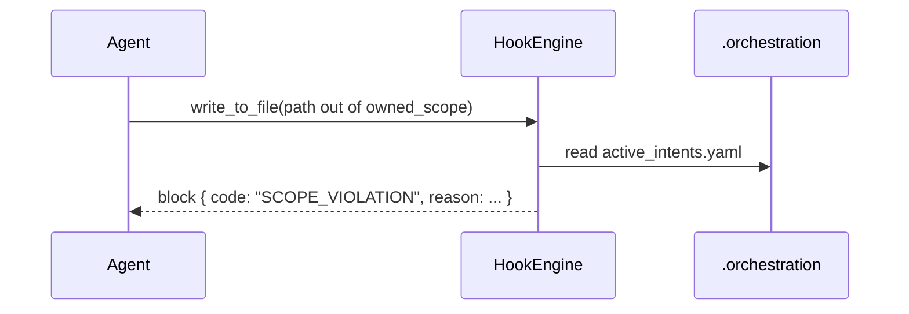
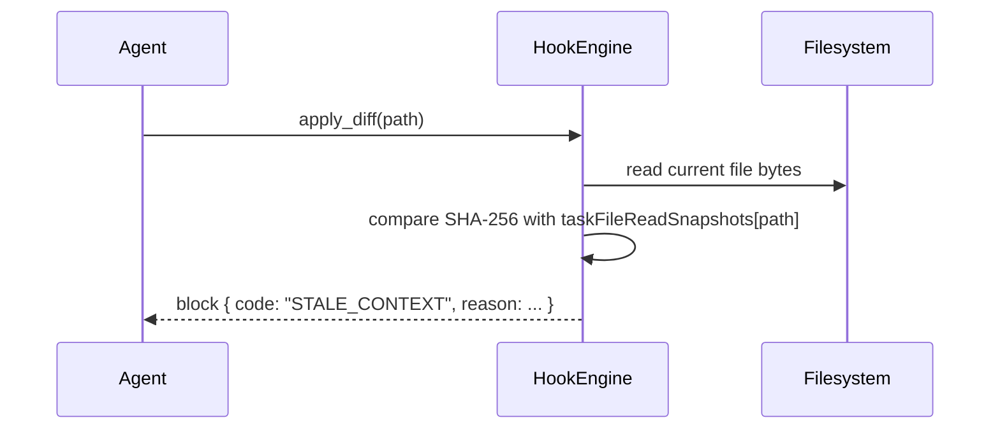

# TRP1 Week 1 Implementation Report (Code-Accurate)

This document describes what is implemented in this repository now, not what was originally planned.

## 1) System Scope and Current Runtime Boundary

The governance runtime is implemented at the extension-host tool loop in:

- `src/core/assistant-message/presentAssistantMessage.ts`
- Hook module root: `src/hooks/`

Execution boundary:

1. Assistant emits `tool_use`.
2. Host validates tool/mode.
3. Host runs `HookEngine.runPreHooks(...)`.
4. Host dispatches tool.
5. Host runs `HookEngine.runPostHooks(...)`.
6. Host returns `tool_result`.

## 2) Implemented Architecture (What Actually Exists)

### 2.1 Middleware and Hook Registration

`HookEngine` is a typed middleware runner (`src/hooks/HookEngine.ts`) with:

- `registerPreHook(hook: PreToolHook): void`
- `registerPostHook(hook: PostToolHook): void`
- `runPreHooks(context): Promise<HookDecision>` (fail-closed)
- `runPostHooks(context): Promise<{ errors: string[] }>` (fail-safe)

Registered in runtime (`src/core/assistant-message/presentAssistantMessage.ts`):

- Pre-hooks:
    - `RequireIntentPreHook`
    - `ScopeEnforcementPreHook`
    - `StaleReadPreHook`
- Post-hooks:
    - `TraceMutationPostHook`

### 2.2 Data Flow Ownership (Read/Write Responsibility)

| Component                                        | Reads                                                                 | Writes                                                                                  | Trigger                                    |
| ------------------------------------------------ | --------------------------------------------------------------------- | --------------------------------------------------------------------------------------- | ------------------------------------------ |
| `RequireIntentPreHook`                           | `toolArgs.intent_id`, `taskActiveIntentId`, `taskActiveMutationClass` | context patch keys: `active_intent_id`, `resolved_intent_id`, `resolved_mutation_class` | Every mutating tool pre-dispatch           |
| `ScopeEnforcementPreHook`                        | `.orchestration/active_intents.yaml`, tool target paths               | none (returns decision/context patch)                                                   | Every write-class tool pre-dispatch        |
| `StaleReadPreHook`                               | `taskFileReadSnapshots`, current file bytes from disk                 | none (returns decision)                                                                 | Every write-class tool pre-dispatch        |
| `TraceMutationPostHook`                          | tool args, changed paths, file content, git HEAD                      | `.orchestration/agent_trace.jsonl` (append-only)                                        | After successful mutating tool execution   |
| `SelectActiveIntentTool`                         | `.orchestration/active_intents.yaml`                                  | task state: `activeIntentId`, `activeIntentMutationClass`                               | `select_active_intent` tool call           |
| `Task.recordFileReadSnapshot` + read/write tools | file content at read/write time                                       | in-memory map `fileReadSnapshots`                                                       | `read_file` and successful write mutations |

## 3) Exact Contracts and Schemas

### 3.1 Hook Contracts (from `src/hooks/types.ts`)

```ts
export interface FileReadSnapshot {
	sha256: string
	capturedAt: string
}

export interface HookContext {
	taskId: string
	toolName: string
	toolArgs: Record<string, unknown>
	cwd?: string
	timestamp: string
	taskActiveIntentId?: string
	taskActiveMutationClass?: "AST_REFACTOR" | "INTENT_EVOLUTION"
	taskFileReadSnapshots?: Record<string, FileReadSnapshot>
}

export type BlockCode = "INTENT_REQUIRED" | "SCOPE_VIOLATION" | "STALE_CONTEXT" | "DESTRUCTIVE_BLOCKED" | "HOOK_ERROR"

export type HookDecision =
	| { allow: true; contextPatch?: Record<string, unknown> }
	| { allow: false; reason: string; code: BlockCode }
```

### 3.2 Active Intent Sidecar (`.orchestration/active_intents.yaml`)

Runtime-required fields used by hooks/tools:

- Root: `active_intents: ActiveIntent[]`
- `ActiveIntent`:
    - `id: string`
    - `name: string`
    - `status: string`
    - `owned_scope: string[]`
    - `constraints?: string[]`
    - `acceptance_criteria?: string[]`

### 3.3 Trace Ledger Schema (`TraceMutationPostHook`)

Record appended as JSONL:

- `id: string` (UUID v4)
- `timestamp: string` (ISO8601)
- `intent_id: string`
- `mutation_class: "AST_REFACTOR" | "INTENT_EVOLUTION" | "UNKNOWN"`
- `vcs.revision_id: string` (from `git rev-parse HEAD`, fallback `"unknown"`)
- `files: TraceFile[]`
    - `relative_path: string`
    - `conversations: TraceConversation[]`
        - `url: string` (task id)
        - `contributor.entity_type: "AI" | "HUMAN"`
        - `contributor.model_identifier?: string`
        - `ranges: { start_line: number; end_line: number; content_hash: string }[]`
        - `related: { type: string; value: string }[]`

Hash format:

- `content_hash = "sha256:" + sha256(fileContentUtf8)`

### 3.4 Mutation Metadata Requirement

Mutating native tool schemas now require:

- `intent_id: string`
- `mutation_class: "AST_REFACTOR" | "INTENT_EVOLUTION"`

Applied to:

- `write_to_file`, `apply_diff`, `edit`, `search_replace`, `edit_file`, `apply_patch`, `execute_command`.

## 4) End-to-End Agent Flow and State Transitions

### 4.1 Control States

- `NO_ACTIVE_INTENT`
- `INTENT_SELECTED`
- `MUTATION_ALLOWED`
- `MUTATION_BLOCKED` (terminal for current tool call)

Transitions:

1. `NO_ACTIVE_INTENT -> INTENT_SELECTED` via `select_active_intent(intent_id, mutation_class)` success.
2. `INTENT_SELECTED -> MUTATION_ALLOWED` if pre-hooks all return allow.
3. `INTENT_SELECTED -> MUTATION_BLOCKED` if any pre-hook returns deny (`INTENT_REQUIRED`, `SCOPE_VIOLATION`, `STALE_CONTEXT`, `HOOK_ERROR`).

### 4.2 Happy Path (Intent + Write + Trace)



### 4.3 Failure Path A: Missing Intent



### 4.4 Failure Path B: Scope Violation



### 4.5 Failure Path C: Stale Context Rejection



### 4.6 HITL Rejection Path

If user denies approval in the tool flow (inside tool execution), mutation is rejected and no trace append occurs for that rejected change.

## 5) Architectural Decision Justification

### 5.1 Why YAML Sidecar Over SQLite

- Chosen: workspace-local YAML/JSONL sidecars in `.orchestration/`.
- Rationale:
    - Human-auditable and git-diff-friendly.
    - Low integration overhead for a VS Code extension runtime.
    - Keeps governance artifacts colocated with source edits.
- Debt linkage:
    - Reduces Trust Debt by making governance state inspectable without specialized tooling.

### 5.2 Why Append-Only Trace Ledger

- Chosen: append-only `agent_trace.jsonl`.
- Rationale:
    - Prevents silent historical rewrite.
    - Supports chronological audit reconstruction.
- Debt linkage:
    - Reduces Trust Debt and Context Rot by preserving immutable change chronology.

### 5.3 Why Hashing Strategy (SHA-256 of file content)

- Chosen: `sha256(fileContentUtf8)` with prefixed `sha256:` marker.
- Rationale:
    - Content-addressable integrity check.
    - Verifiable independently from line movement.
- Debt linkage:
    - Reduces Cognitive Debt in code review by grounding trace claims in deterministic digests.

## 6) Trade-offs, Limitations, and Deviations

### 6.1 Implemented but Limited

- Mutation classification is heuristic (`TraceMutationPostHook.computeMutationClass`), not AST-semantic diffing.
- Hook registration is explicit in host loop (good structure, not yet factory/registry abstraction).
- Stale lock currently applies to write-oriented file tools, not all possible side effects of shell commands.
- Post-hook trace emission is triggered after mutating tool dispatch; there is no explicit success-only guard in hook context yet, so rejected/failed writes can still be traced.

### 6.2 Planned but Not Fully Automated

- `.orchestration/intent_map.md` and `.orchestration/shared_brain.md` are present and validated for existence/consistency, but not yet fully runtime-populated by dedicated post-hook writers per mutation class.

### 6.3 Deviation from Initial Interim Plan

- Initial interim docs described several pieces as “planned”.
- Current code now includes runtime hook wiring, stale lock, trace writing, governance tests, and CI gate.
- This report supersedes those interim statements.

## 7) Achievement Inventory (Verifiable)

### 7.1 Fully Implemented

- Hook middleware with typed contracts and fail-closed/fail-safe behavior.
- Intent handshake tool and active intent persistence in task state.
- Required mutation metadata in mutating tool schemas and parser flow.
- Pre-hook governance: intent required, scope check, stale context check.
- Post-hook trace append with SHA-256 hash and git revision capture.
- Governance CI gate (`pnpm governance:ci`) with orchestration artifact validation.

### 7.2 Partially Implemented

- Mutation semantic classification (heuristic quality).
- Artifact lifecycle automation for shared brain and intent map.

### 7.3 Not Implemented

- AST-level semantic classification engine for mutation class.
- Dedicated runtime writer that materializes rich intent-map deltas from each trace event.

## 8) Lessons Learned (Technical)

1. Stateless prompt reassembly means enforcement must be runtime, not prompt-only; schema + pre-hook + task-state alignment is required to avoid bypasses.
2. Patch-based tools require parsing of patch headers (`Add/Update/Delete/Move`) for both scope policy and trace completeness.
3. Stale-write prevention needs read-snapshot refresh after successful mutations, or valid sequential edits are falsely blocked.
4. Governance claims are fragile unless CI checks both tests and artifact consistency; one command (`pnpm governance:ci`) reduced drift.

## 9) Validation Commands

```bash
pnpm governance:ci
```

Current result in this workspace:

- Governance suite passed.
- Type-check passed.
- `.orchestration` integrity validator passed.

## 10) Next Steps (Post-Week 1)

1. Introduce hook factory/registry to remove concrete hook knowledge from host runtime wiring.
2. Implement richer mutation class classification based on AST/diff semantics.
3. Add runtime intent lifecycle enforcement (`LOCKED` / terminal status) in `select_active_intent`.
4. Add dedicated post-hooks to machine-update intent map/shared brain from trace stream.
