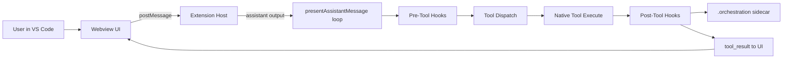
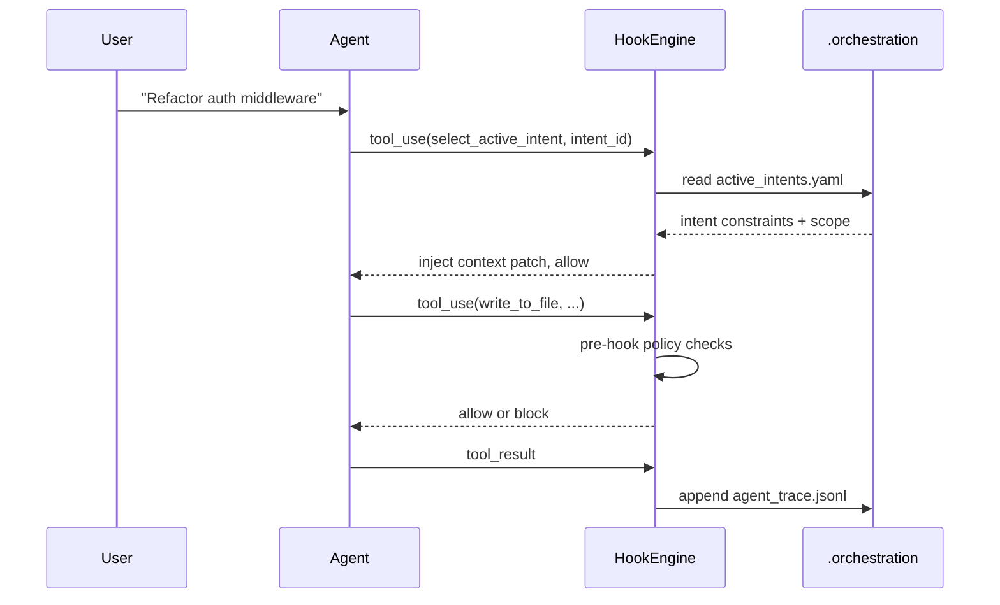

# TRP1 Challenge Week 1 — Interim Report

## 1. How the VS Code Extension Works

### 1.1 High-Level Architecture

Roo Code is a VS Code extension that provides an AI-powered coding assistant running entirely inside the editor. Its architecture follows a strict **three-layer separation**:

| Layer              | Responsibility                                                                                                                                                      | Key Files                        |
| ------------------ | ------------------------------------------------------------------------------------------------------------------------------------------------------------------- | -------------------------------- |
| **Webview UI**     | Presentation layer — renders chat, diff views, settings. Communicates with the extension host via `postMessage`. Cannot access the file system or network directly. | `webview-ui/src/` (React + Vite) |
| **Extension Host** | Core logic — receives messages from the webview, manages tasks, invokes LLM APIs, executes tools, handles approval gates, and manages MCP servers.                  | `src/extension.ts`, `src/core/`  |
| **LLM Providers**  | External API layer — sends system prompt + conversation history to model providers (Anthropic, OpenAI, etc.) and streams back assistant responses.                  | `src/api/providers/`             |

### 1.2 Extension Activation

When VS Code activates the extension (`src/extension.ts:120`):

1. An output channel is created for logging.
2. Telemetry, i18n, terminal registry, and network proxy are initialized.
3. A `ClineProvider` is instantiated — this is the central controller that bridges the webview and the task runtime.
4. The provider is registered as a `WebviewViewProvider` on VS Code's sidebar.
5. Commands, code actions, and terminal actions are registered.
6. Cloud services and MCP server manager are initialized.

### 1.3 Message Flow: User Prompt → Tool Execution

```
User types prompt in Webview
        |
        v
  postMessage("newTask", text)
        |
        v
  ClineProvider.setWebviewMessageListener()  [ClineProvider.ts:1326]
        |
        v
  webviewMessageHandler()  [webviewMessageHandler.ts:89]
        |  case "newTask" -> provider.createTask(text)
        v
  Task created  [src/core/task/Task.ts]
        |  Task.start() -> recursivelyMakeClineRequests()
        v
  System prompt built  [src/core/prompts/system.ts:41]
  Tools built  [src/core/task/build-tools.ts:82]
        |
        v
  LLM API call  [src/api/providers/*.ts]
        |  Streams assistant response
        v
  presentAssistantMessage()  [presentAssistantMessage.ts:61]
        |  Processes content blocks sequentially
        |  For each tool_use block:
        |    1. validateToolUse()  -- mode/permission check
        |    2. askApproval()      -- human-in-the-loop gate
        |    3. tool.execute()     -- runs the tool
        |    4. pushToolResult()   -- returns result to conversation
        v
  Next LLM turn or completion
```

### 1.4 Tool System

Tools are the agent's interface to the environment. Each tool is:

- **Defined** as an OpenAI-compatible function schema in `src/core/prompts/tools/native-tools/`.
- **Filtered** per mode (architect, code, ask, etc.) in `src/core/prompts/tools/filter-tools-for-mode.ts`.
- **Dispatched** in the tool switch block of `presentAssistantMessage.ts` (~line 678).
- **Implemented** as a class extending `BaseTool` in `src/core/tools/`.

Current native tools include: `write_to_file`, `execute_command`, `read_file`, `list_files`, `search_files`, `apply_diff`, `apply_patch`, `edit_file`, `search_replace`, `codebase_search`, `use_mcp_tool`, `access_mcp_resource`, `ask_followup_question`, `attempt_completion`, `switch_mode`, `new_task`, `update_todo_list`, `run_slash_command`, `skill`, `generate_image`.

### 1.5 Approval and Auto-Approval

Before any tool executes, the extension runs an approval gate:

- **Manual approval**: The user sees a prompt (diff view for writes, command preview for execution) and clicks Approve/Reject.
- **Auto-approval**: Configurable policies in `src/core/auto-approval/index.ts:47` can auto-approve safe operations (reads) while requiring manual approval for destructive ones (writes, commands).
- **Protected files**: `rooIgnoreController` and `rooProtectedController` add file-level access restrictions.

---

## 2. Code and Design Architecture of the Agent (Phase 0 — ARCHITECTURE_NOTES.md)

### 2.1 End-to-End Execution Path

The following traces the exact code path for every tool call:

| Step | What Happens               | Exact Location                                                            |
| ---- | -------------------------- | ------------------------------------------------------------------------- |
| 1    | System prompt generated    | `src/core/prompts/system.ts:41` (generatePrompt)                          |
| 2    | Tool definitions built     | `src/core/prompts/tools/native-tools/index.ts:42` (getNativeTools)        |
| 3    | Per-request tool filtering | `src/core/task/build-tools.ts:82` (buildNativeToolsArrayWithRestrictions) |
| 4    | Assistant output processed | `src/core/assistant-message/presentAssistantMessage.ts:61`                |
| 5    | Tool permission check      | `presentAssistantMessage.ts:597` → `validateToolUse()`                    |
| 6    | Human approval gate        | `presentAssistantMessage.ts:494` (askApproval callback)                   |
| 7    | Tool result callback       | `presentAssistantMessage.ts:449` (pushToolResult callback)                |
| 8    | Tool dispatch switch       | `presentAssistantMessage.ts:678`                                          |
| 9    | `write_to_file` dispatch   | `presentAssistantMessage.ts:679` → `WriteToFileTool.execute()`            |
| 10   | `execute_command` dispatch | `presentAssistantMessage.ts:764` → `ExecuteCommandTool.execute()`         |

### 2.2 Detailed Sequence: write_to_file

1. Assistant emits `tool_use(write_to_file, {path, content})`.
2. `validateToolUse` checks mode permissions.
3. `askApproval` presents a diff view to the user.
4. `WriteToFileTool.execute()` runs at `src/core/tools/WriteToFileTool.ts:29`.
5. Access checks: `rooIgnoreController.validateAccess()` (line 50), `rooProtectedController.isWriteProtected()` (line 58).
6. Diff is computed, shown in editor, and user approves.
7. File is saved to disk.
8. Result is pushed through `pushToolResult` back into the conversation.

### 2.3 Detailed Sequence: execute_command

1. Assistant emits `tool_use(execute_command, {command, cwd})`.
2. `validateToolUse` checks mode permissions.
3. `askApproval` shows the command for approval.
4. `ExecuteCommandTool.execute()` runs at `src/core/tools/ExecuteCommandTool.ts:34`.
5. Command is validated against `rooIgnoreController`.
6. Terminal execution with timeout and allowlist checks.
7. Output is streamed to webview and final result becomes `tool_result`.

### 2.4 Hook Injection Points Identified

| Injection Point     | Location                                                        | Purpose                                                                      |
| ------------------- | --------------------------------------------------------------- | ---------------------------------------------------------------------------- |
| **Pre-hook**        | Before tool dispatch switch at `presentAssistantMessage.ts:678` | Enforce intent handshake, scope validation, command classification           |
| **Post-hook**       | After tool execution at `presentAssistantMessage.ts:920`        | Record trace entries, compute content hashes, update sidecar files           |
| **Prompt protocol** | `src/core/prompts/system.ts:41`                                 | Add handshake instructions requiring `select_active_intent` before mutations |
| **Tool contract**   | `src/core/prompts/tools/native-tools/index.ts:42`               | Register new `select_active_intent` tool definition                          |

### 2.5 Current Gaps Against Target Architecture

- No `select_active_intent` tool exists yet.
- No `.orchestration/` sidecar integration in the tool execution path.
- No intent-linked `agent_trace.jsonl` write path.
- No explicit mutation classification (`AST_REFACTOR`, `INTENT_EVOLUTION`).
- No stale-write optimistic lock guard in the write path.

---

## 3. Architectural Decisions for the Hook

### Decision 1: Middleware Boundary at Tool Execution Loop

- **Decision**: Place hook execution at the extension host tool loop — before and after tool dispatch.
- **Why**: `presentAssistantMessage.ts` is the single central path where every tool call passes. Hooking here guarantees 100% interception coverage.
- **Location**: `src/core/assistant-message/presentAssistantMessage.ts`.
- **Tradeoff**: Tight coupling to current execution loop shape; requires careful refactoring if the loop changes.

### Decision 2: Two-Stage Handshake for Mutating Tools

- **Decision**: Mutating tools (`write_to_file`, `execute_command`, `apply_diff`, etc.) must require an active intent selected through `select_active_intent(intent_id)` before execution.
- **Why**: Enforces intent-code traceability. Every code mutation has a traceable business reason.
- **Tradeoff**: Adds one extra tool call before writes/commands. Read-only tools remain unblocked.

### Decision 3: Fail-Closed for Governance, Fail-Safe for Observability

- **Decision**: Pre-hooks block on policy violations (fail-closed). Post-hooks do not block user progress if telemetry/trace writes fail (fail-safe).
- **Why**: Policy enforcement must be strict — an unaudited mutation cannot be allowed. But logging failures should not corrupt the main task loop.
- **Tradeoff**: Post-hook failures must be surfaced clearly for audit (logged as errors, not silently dropped).

### Decision 4: Sidecar Data Model in `.orchestration/`

- **Decision**: Persist intent and trace artifacts in workspace-local sidecar files under `.orchestration/`.
- **Why**: Keeps audit metadata close to code changes. Files can be committed to version control alongside the code they describe.
- **Tradeoff**: File-based writes need append discipline and eventual compaction for the JSONL ledger.

### Decision 5: Append-Only Trace Ledger

- **Decision**: `agent_trace.jsonl` uses append-only records with content hashes.
- **Why**: Prevents silent history rewrites and supports deterministic auditing. Content hashes ensure spatial independence (if code lines move, the hash still validates).
- **Tradeoff**: Requires periodic compaction strategy if the file grows large.

### Decision 6: Minimal Clean Hook Module

- **Decision**: Keep hook contracts and engine isolated in `src/hooks/`, separate from the core execution loop.
- **Why**: Prevents spaghetti logic in the main tool dispatch. Enables composable, testable hooks that can be registered independently.
- **Tradeoff**: Requires explicit wiring points at integration time.

---

## 4. Diagrams and Schemas of the Hook System

### 4.1 Runtime Boundary Diagram



### 4.2 Two-Stage Handshake Sequence



### 4.3 Hook Engine Type Schema

```typescript
// src/hooks/types.ts

export type HookPhase = "preToolUse" | "postToolUse"

export interface HookContext {
	taskId: string
	toolName: string
	toolArgs: Record<string, unknown>
	cwd?: string
	timestamp: string
}

export type BlockCode = "INTENT_REQUIRED" | "SCOPE_VIOLATION" | "DESTRUCTIVE_BLOCKED" | "HOOK_ERROR"

export type HookDecision =
	| { allow: true; contextPatch?: Record<string, unknown> }
	| { allow: false; reason: string; code: BlockCode }

export interface PreToolHook {
	name: string
	run(context: HookContext): Promise<HookDecision> | HookDecision
}

export interface PostToolHookContext extends HookContext {
	toolResult: unknown
	changedFiles: string[]
}

export interface PostToolHook {
	name: string
	run(context: PostToolHookContext): Promise<void> | void
}
```

### 4.4 HookEngine Implementation

```typescript
// src/hooks/HookEngine.ts

export class HookEngine {
    private readonly preHooks: PreToolHook[] = []
    private readonly postHooks: PostToolHook[] = []

    registerPreHook(hook: PreToolHook): void { ... }
    registerPostHook(hook: PostToolHook): void { ... }

    async runPreHooks(context: HookContext): Promise<HookDecision> {
        // Runs all pre-hooks sequentially.
        // If any hook returns { allow: false }, execution is blocked immediately.
        // Context patches from passing hooks are merged.
        // Errors in hooks are caught and returned as HOOK_ERROR blocks.
    }

    async runPostHooks(context: PostToolHookContext): Promise<{ errors: string[] }> {
        // Runs all post-hooks sequentially.
        // Errors are collected but do not block the main flow (fail-safe).
    }
}
```

### 4.5 `active_intents.yaml` Schema

```yaml
# .orchestration/active_intents.yaml
active_intents:
    - id: "INT-001"
      name: "JWT Authentication Migration"
      status: "IN_PROGRESS"
      owned_scope:
          - "src/auth/**"
          - "src/middleware/jwt.ts"
      constraints:
          - "Must not use external auth providers"
          - "Must maintain backward compatibility with Basic Auth"
      acceptance_criteria:
          - "Unit tests in tests/auth/ pass"
```

### 4.6 `agent_trace.jsonl` Record Schema

```json
{
	"id": "uuid-v4",
	"timestamp": "2026-02-18T12:00:00Z",
	"intent_id": "INT-001",
	"mutation_class": "AST_REFACTOR",
	"vcs": { "revision_id": "git_sha_hash" },
	"files": [
		{
			"relative_path": "src/auth/middleware.ts",
			"conversations": [
				{
					"url": "session_log_id",
					"contributor": {
						"entity_type": "AI",
						"model_identifier": "claude-3-5-sonnet"
					},
					"ranges": [
						{
							"start_line": 15,
							"end_line": 45,
							"content_hash": "sha256:a8f5f167f44f4964e6c998dee827110c"
						}
					],
					"related": [
						{
							"type": "specification",
							"value": "INT-001"
						}
					]
				}
			]
		}
	]
}
```

---

## 5. Repository Deliverable Status

### 5.1 `src/hooks/` Directory Contents

| File                               | Purpose                                                                          |
| ---------------------------------- | -------------------------------------------------------------------------------- |
| `types.ts`                         | Shared contracts — `PreToolHook`, `PostToolHook`, `HookDecision`, `BlockCode`    |
| `HookEngine.ts`                    | Composable middleware runner with fail-closed pre-hooks and fail-safe post-hooks |
| `builtin/RequireIntentPreHook.ts`  | Pre-hook: blocks mutating tools unless `intent_id` is provided                   |
| `builtin/TraceMutationPostHook.ts` | Post-hook: placeholder for mutation trace recording to `agent_trace.jsonl`       |
| `index.ts`                         | Public exports for the hook module                                               |
| `README.md`                        | Integration guide for wiring hooks into the runtime                              |

### 5.2 Documentation Files

| File                              | Content                                                                                                                 |
| --------------------------------- | ----------------------------------------------------------------------------------------------------------------------- |
| `ARCHITECTURE_NOTES.md`           | Phase 0 archaeological dig: exact file:line mappings for tool loop, prompt builder, approval flow, and injection points |
| `HOOK_ARCHITECTURAL_DECISIONS.md` | 6 explicit design decisions with rationale and tradeoffs                                                                |
| `HOOK_DIAGRAMS_AND_SCHEMAS.md`    | Mermaid diagrams (runtime boundary, handshake sequence) and data schemas                                                |
| `INTERIM_REPORT.md`               | This report                                                                                                             |
| `INTERIM_REPORT.pdf`              | PDF export of this report                                                                                               |

### 5.3 `.orchestration/` Directory

| File                  | Status                                         |
| --------------------- | ---------------------------------------------- |
| `active_intents.yaml` | Created (to be populated with example intents) |
| `agent_trace.jsonl`   | Planned for Phase 3 implementation             |
| `intent_map.md`       | Planned for Phase 3 implementation             |

---

## 6. Interim Scope Note

This interim submission delivers the **Phase 0 (Archaeological Dig)** deliverables and the **Phase 1/2 scaffold**:

- Complete architecture mapping with exact insertion points for hook integration.
- Clean, isolated `src/hooks/` module with typed contracts, engine, and starter hooks.
- Documented architectural decisions and visual schemas.

Full runtime integration (wiring hooks into `presentAssistantMessage.ts`), the `select_active_intent` tool, trace persistence, scope enforcement, and parallel orchestration are planned for the final submission phases.
